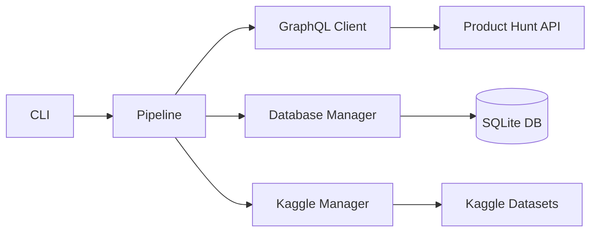

# ProductHuntDB

> **Comprehensive Product Hunt GraphQL API data sink with SQLite storage and Kaggle dataset management**

[](https://www.python.org/downloads/)
[](https://opensource.org/licenses/MIT)

**ProductHuntDB** is a production-grade data pipeline that harvests data from the Product Hunt GraphQL API, stores it in an advanced SQLite database with proper schema design, and manages Kaggle dataset updates. Perfect for researchers, data scientists, and developers building on Product Hunt data.

---

## ✨ Features

### 🚀 Core Capabilities

- **Full & Incremental Harvesting**: Smart incremental updates with configurable safety margins to avoid data loss
- **Async/Concurrent Processing**: HTTP/2 multiplexing with rate limiting and exponential backoff retry logic
- **Advanced SQLite Schema**: Normalized schema with indexes, foreign keys, and WAL mode for optimal performance
- **Kaggle Integration**: Automated dataset creation and versioning on Kaggle
- **Rich CLI Interface**: Intuitive commands with progress bars and colored output
- **Type-Safe Models**: Pydantic v2 validation for API responses, SQLModel for database operations

### 📊 Supported Entities

- **Posts**: Products, launches, descriptions, metrics
- **Users**: Makers, hunters, voters, commenters
- **Topics**: Categories and tags
- **Collections**: Curated product lists
- **Comments**: Discussions and threads
- **Votes**: Upvotes on posts and comments

### 🛡️ Production-Ready Features

- Comprehensive error handling with transient vs. permanent error classification
- Rate limit awareness with adaptive throttling
- Database transaction management with automatic rollback
- Progress tracking with `tqdm` integration
- Structured logging with `loguru`
- Environment-based configuration (local dev + Kaggle notebooks)

---

## 📋 Table of Contents

- [Installation](#-installation)
- [Quick Start](#-quick-start)
- [Configuration](#️-configuration)
- [Usage](#-usage)
- [CLI Reference](#-cli-reference)
- [Architecture](#-architecture)
- [Development](#-development)
- [Kaggle Notebook](#-kaggle-notebook)
- [Contributing](#-contributing)
- [License](#-license)

---

## 🚀 Installation

### Prerequisites

- **Python 3.13+** (required)
- **uv** package manager ([installation guide](https://docs.astral.sh/uv/))
- Product Hunt API token ([get yours here](https://api.producthunt.com/v2/oauth/applications))
- (Optional) Kaggle API credentials for dataset publishing

### Install with `uv`

```bash
# Clone the repository
git clone https://github.com/wyattowalsh/producthuntdb.git
cd producthuntdb

# Create and activate virtual environment
uv venv
source .venv/bin/activate  # On Windows: .venv\Scripts\activate

# Install dependencies
uv sync

# Verify installation
uv run producthuntdb --help
```

### Install from PyPI (coming soon)

```bash
pip install producthuntdb
```

---

## ⚡ Quick Start

### 1. Configure Environment

Create a `.env` file in the project root:

```bash
# Product Hunt API
PRODUCTHUNT_TOKEN=your_token_here

# Kaggle Configuration (optional)
KAGGLE_USERNAME=your_username
KAGGLE_KEY=your_api_key
KAGGLE_DATASET_SLUG=username/dataset-name

# Operational Parameters (optional)
MAX_CONCURRENCY=3
PAGE_SIZE=50
SAFETY_MINUTES=5
```

> [!TIP]
> Copy `.env.example` to `.env` and fill in your credentials

### 2. Initialize Database

```bash
uv run producthuntdb init
```

This creates the SQLite database with all necessary tables and indexes.

### 3. Verify Authentication

```bash
uv run producthuntdb verify
```

Confirms your API token is valid and displays your authenticated user info.

### 4. Sync Data

```bash
# Incremental update (default)
uv run producthuntdb sync

# Full refresh
uv run producthuntdb sync --full-refresh

# Sync only posts (useful for testing)
uv run producthuntdb sync --posts-only --max-pages 5

# Verbose output
uv run producthuntdb sync -v
```

### 5. Check Status

```bash
uv run producthuntdb status
```

Displays database statistics, configuration, and last sync timestamps.

### 6. Export & Publish to Kaggle

```bash
# Export database to CSV files
uv run producthuntdb export --output-dir ./data

# Publish to Kaggle (exports automatically if needed)
uv run producthuntdb publish
```

---

## ⚙️ Configuration

ProductHuntDB uses **Pydantic Settings** for configuration management, supporting both environment variables and `.env` files.

### Environment Variables

| Variable | Required | Default | Description |
|----------|----------|---------|-------------|
| `PRODUCTHUNT_TOKEN` | ✅ Yes | — | Product Hunt API authentication token |
| `KAGGLE_USERNAME` | ❌ No | — | Kaggle username for dataset publishing |
| `KAGGLE_KEY` | ❌ No | — | Kaggle API key |
| `KAGGLE_DATASET_SLUG` | ❌ No | `wyattowalsh/producthuntdb` | Dataset identifier (username/dataset-name) |
| `GRAPHQL_ENDPOINT` | ❌ No | `https://api.producthunt.com/v2/api/graphql` | Product Hunt GraphQL endpoint |
| `DATA_DIR` | ❌ No | `./data` | Base directory for all data files |
| `DATABASE_PATH` | ❌ No | `./data/producthunt.db` | SQLite database file path (defaults to DATA_DIR/producthunt.db) |
| `MAX_CONCURRENCY` | ❌ No | `3` | Maximum concurrent API requests (1-10) |
| `PAGE_SIZE` | ❌ No | `50` | Items per GraphQL query page (1-100) |
| `SAFETY_MINUTES` | ❌ No | `5` | Safety margin for incremental updates (0-60) |

### Kaggle Notebook Configuration

When running in Kaggle notebooks, use **Kaggle Secrets** to store credentials:

1. Go to your notebook → **Add-ons** → **Secrets**
2. Add secrets:
   - `PRODUCTHUNT_TOKEN`
   - `KAGGLE_USERNAME`
   - `KAGGLE_KEY`
3. The library automatically detects Kaggle environment and loads secrets

---

## � Data Directory Structure

ProductHuntDB organizes all data files in the `./data/` directory for better organization and portability:

```
data/
├── producthunt.db          # Main SQLite database (WAL mode enabled)
├── producthunt.db-wal      # Write-Ahead Log file
├── producthunt.db-shm      # Shared memory file
└── export/                 # CSV exports for Kaggle dataset
    ├── producthunt.db      # Database copy for distribution
    ├── userrow.csv
    ├── postrow.csv
    ├── topicrow.csv
    ├── collectionrow.csv
    ├── commentrow.csv
    ├── voterow.csv
    ├── posttopiclink.csv
    ├── makerpostlink.csv
    ├── collectionpostlink.csv
    ├── crawlstate.csv
    └── dataset-metadata.json
```

### Configuration

You can customize the data directory location:

```bash
# Set custom data directory
export DATA_DIR=/path/to/data

# Or set database path directly
export DATABASE_PATH=/path/to/database.db
```

### Database Migrations

ProductHuntDB uses [Alembic](https://alembic.sqlalchemy.org/) for database schema version control:

```bash
# Create a new migration
producthuntdb migrate --message "add new column"

# Apply migrations
producthuntdb upgrade

# View migration history
producthuntdb migration-history

# Rollback one revision
producthuntdb downgrade
```

See the [Database Migrations Guide](docs/source/guides/migrations.md) for detailed information.

---

## �📖 Usage

### Python API

ProductHuntDB can be used programmatically in Python scripts:

```python
import asyncio
from producthuntdb.pipeline import DataPipeline
from producthuntdb.config import settings

async def main():
    # Initialize pipeline
    pipeline = DataPipeline()
    await pipeline.initialize()
    
    # Verify authentication
    viewer = await pipeline.verify_authentication()
    print(f"Authenticated as: {viewer['user']['username']}")
    
    # Sync posts (incremental)
    stats = await pipeline.sync_posts(full_refresh=False, max_pages=10)
    print(f"Synced {stats['posts']} posts")
    
    # Get database statistics
    db_stats = pipeline.get_statistics()
    print(f"Total posts in DB: {db_stats['posts']}")
    
    # Cleanup
    pipeline.close()

# Run
asyncio.run(main())
```

### Direct Database Access

```python
from sqlmodel import Session, create_engine, select
from producthuntdb.models import PostRow, UserRow
from producthuntdb.config import settings

# Connect to database
engine = create_engine(settings.database_url)
session = Session(engine)

# Query posts
stmt = select(PostRow).order_by(PostRow.votesCount.desc()).limit(10)
top_posts = session.exec(stmt).all()

for post in top_posts:
    print(f"{post.name} - {post.votesCount} votes")

session.close()
```

### Async GraphQL Client

```python
import asyncio
from producthuntdb.io import AsyncGraphQLClient
from producthuntdb.config import PostsOrder

async def fetch_posts():
    client = AsyncGraphQLClient()
    
    # Fetch posts
    posts = await client.fetch_posts_page(
        after_cursor=None,
        posted_after_dt=None,
        first=50,
        order=PostsOrder.NEWEST
    )
    
    print(f"Found {len(posts['nodes'])} posts")
    
    # Check rate limit
    rate_limit = client.get_rate_limit_status()
    print(f"Rate limit: {rate_limit['remaining']}/{rate_limit['limit']}")

asyncio.run(fetch_posts())
```

---

## 🖥️ CLI Reference

### `producthuntdb sync`

Synchronize data from Product Hunt API to local database.

**Options:**
- `--full-refresh`, `-f`: Perform full refresh instead of incremental update
- `--max-pages`, `-n`: Maximum pages to fetch per entity (for testing)
- `--posts-only`: Only sync posts (skip topics and collections)
- `--topics-only`: Only sync topics
- `--collections-only`: Only sync collections
- `--verbose`, `-v`: Enable verbose logging

**Examples:**
```bash
# Incremental update
uv run producthuntdb sync

# Full refresh
uv run producthuntdb sync --full-refresh

# Test with limited pages
uv run producthuntdb sync --posts-only --max-pages 5 -v
```

### `producthuntdb export`

Export database tables to CSV files.

**Options:**
- `--output-dir`, `-o`: Directory to write CSV files (default: `./export`)
- `--verbose`, `-v`: Enable verbose logging

**Examples:**
```bash
# Export to default directory
uv run producthuntdb export

# Export to custom directory
uv run producthuntdb export --output-dir /path/to/output
```

### `producthuntdb publish`

Publish or update Kaggle dataset.

**Options:**
- `--data-dir`, `-d`: Directory containing CSV files (auto-exports if not provided)
- `--title`, `-t`: Dataset title (default: "ProductHuntDB")
- `--description`: Dataset description
- `--verbose`, `-v`: Enable verbose logging

**Examples:**
```bash
# Export and publish in one step
uv run producthuntdb publish

# Publish existing export
uv run producthuntdb publish --data-dir ./export
```

### `producthuntdb status`

Show database statistics and pipeline status.

**Examples:**
```bash
uv run producthuntdb status
```

### `producthuntdb verify`

Verify API authentication and connectivity.

**Examples:**
```bash
uv run producthuntdb verify
```

### `producthuntdb init`

Initialize database and verify setup.

**Options:**
- `--force`, `-f`: Force re-initialization (recreate database)
- `--verbose`, `-v`: Enable verbose logging

**Examples:**
```bash
# Initialize database
uv run producthuntdb init

# Force re-initialization
uv run producthuntdb init --force
```

---

## 🏗️ Architecture

### Component Overview



### Module Structure

```
producthuntdb/
├── cli.py          # Typer-based CLI interface
├── config.py       # Pydantic Settings configuration
├── models.py       # Pydantic/SQLModel data models
├── utils.py        # Utility functions (datetime, GraphQL, etc.)
├── io.py           # I/O operations (API client, database, Kaggle)
├── pipeline.py     # ETL orchestration logic
└── __init__.py     # Package initialization
```

### Database Schema

**Core Tables:**
- `UserRow`: Product Hunt users (makers, hunters, voters)
- `PostRow`: Product launches and products
- `TopicRow`: Categories and tags
- `CollectionRow`: Curated product lists
- `CommentRow`: Discussions and threads
- `VoteRow`: Upvotes on posts and comments

**Link Tables (Many-to-Many):**
- `PostTopicLink`: Posts ↔ Topics
- `MakerPostLink`: Users (makers) ↔ Posts
- `CollectionPostLink`: Collections ↔ Posts

**Tracking:**
- `CrawlState`: Incremental update checkpoints

### Data Flow

1. **Extract**: Async GraphQL client fetches paginated data from Product Hunt API
2. **Validate**: Pydantic models parse and validate API responses
3. **Transform**: Data is normalized and prepared for database storage
4. **Load**: SQLModel ORM inserts/updates records with proper relationships
5. **Export**: Database tables are exported to CSV files
6. **Publish**: CSV files are uploaded to Kaggle with automatic versioning

---

## 🛠️ Development

### Setup Development Environment

```bash
# Install all dependency groups
uv sync --all-groups

# Install pre-commit hooks
uv run pre-commit install

# Run linters
uv run ruff check .
uv run mypy producthuntdb

# Run tests
uv run pytest

# Format code
uv run ruff format .
```

### Project Structure

```
producthuntdb/
├── producthuntdb/          # Main package
│   ├── __init__.py
│   ├── cli.py
│   ├── config.py
│   ├── models.py
│   ├── utils.py
│   ├── io.py
│   └── pipeline.py
├── tests/                  # Unit tests (mirrors package structure)
├── docs/                   # Sphinx documentation
├── .github/                # GitHub workflows and context
├── pyproject.toml          # Project configuration
├── README.md               # This file
└── .env.example            # Example environment configuration
```

### Running Tests

```bash
# Run all tests
uv run pytest

# Run with coverage
uv run pytest --cov=producthuntdb

# Run specific test file
uv run pytest tests/test_models.py

# Run with verbose output
uv run pytest -v
```

### Building Documentation

```bash
# Install docs dependencies
uv sync --group docs

# Build HTML documentation
cd docs
uv run make html

# Serve documentation locally
uv run sphinx-autobuild source _build/html
```

---

## 📓 Kaggle Notebook

The project includes a comprehensive Kaggle notebook (`nb.ipynb`) that can be used to:

1. Run the full pipeline in Kaggle's environment
2. Analyze Product Hunt data with pandas
3. Create visualizations and insights
4. Publish dataset updates automatically

### Using the Notebook

1. Upload `nb.ipynb` to Kaggle
2. Configure Kaggle Secrets (see [Configuration](#️-configuration))
3. Run all cells to sync data and publish dataset
4. Schedule notebook for automatic updates

---

## 🤝 Contributing

Contributions are welcome! Please follow these guidelines:

1. **Fork the repository**
2. **Create a feature branch**: `git checkout -b feature/amazing-feature`
3. **Make your changes** with clear commit messages
4. **Add tests** for new functionality
5. **Run linters**: `uv run ruff check . && uv run mypy producthuntdb`
6. **Submit a pull request**

### Code Style

- Follow PEP 8 and PEP 257 conventions
- Use type hints for all function signatures
- Write comprehensive docstrings (NumPy style)
- Maintain test coverage above 80%

---

## 📄 License

This project is licensed under the **MIT License** - see the [LICENSE](LICENSE) file for details.

---

## 🙏 Acknowledgments

- **Product Hunt** for providing the GraphQL API
- **Kaggle** for dataset hosting platform
- Open source libraries: Pydantic, SQLModel, Typer, httpx, Tenacity, and more

---

## 📞 Contact & Support

- **Issues**: [GitHub Issues](https://github.com/wyattowalsh/producthuntdb/issues)
- **Discussions**: [GitHub Discussions](https://github.com/wyattowalsh/producthuntdb/discussions)
- **Kaggle Dataset**: [producthuntdb](https://www.kaggle.com/datasets/wyattowalsh/producthuntdb)

---

<div align="center">

**⭐ Star this repository if you find it useful!**

Made with ❤️ by [Wyatt Walsh](https://github.com/wyattowalsh)

</div>
